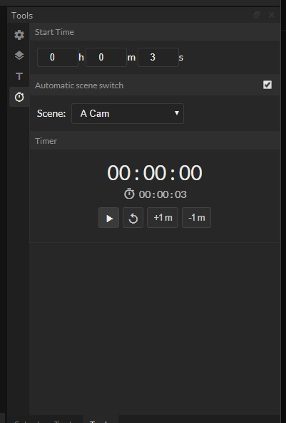

# Multi Tool Dock for OBS Studio

## OBS Custom Dock URL:
- Github Pages (Latest): https://luckydye.github.io/obs-tools-widget/public/dock/index.html
- Firebase App (Stable): https://obs-tools-widget.web.app/dock/

## Features:
- [x] Timer
- [x] Subathon timer tools
- [ ] Connect to twitch for PubSub integration and more (enables Channel Point Rewards)
- [x] Video Assist features (with OBS flag "--use-fake-ui-for-media-stream")
- [x] Source Layout Presets
- [ ] Midi Scene Switching and trigger layout presets
- [ ] Add Custom Overlays

Use graphcms as a dynamic overlay registry.