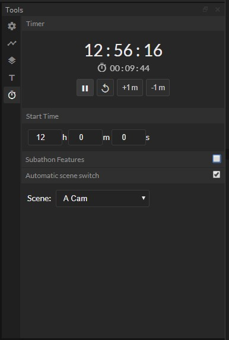

# Multi Tool Dock for OBS Studio

Several Tools and simple browsing and configuration of custom overlays.

## OBS Custom Dock URL:
- Github Pages (Latest): https://luckydye.github.io/obs-tools-widget/public/dock/index.html
- Firebase App (Stable): https://obs-tools-widget.web.app/dock/

## Features:
- [x] Timer
- [x] Subathon timer tools
- [x] Video Assist features (with OBS flag "--use-fake-ui-for-media-stream")
- [x] Source Layout Presets
- [x] Overlay properties (with https://github.com/Palakis/obs-websocket/blob/4.x-current/docs/generated/protocol.md#sceneitemselected)
- [ ] Midi Scene Switching and trigger layout presets
- [ ] Scene/Source Presets like the overlay. creating sources with socket.
- [ ] Add third party overlays
- [ ] Add some default overlays
    - Last Follower etc.
    - Follower/Sub Alerts
